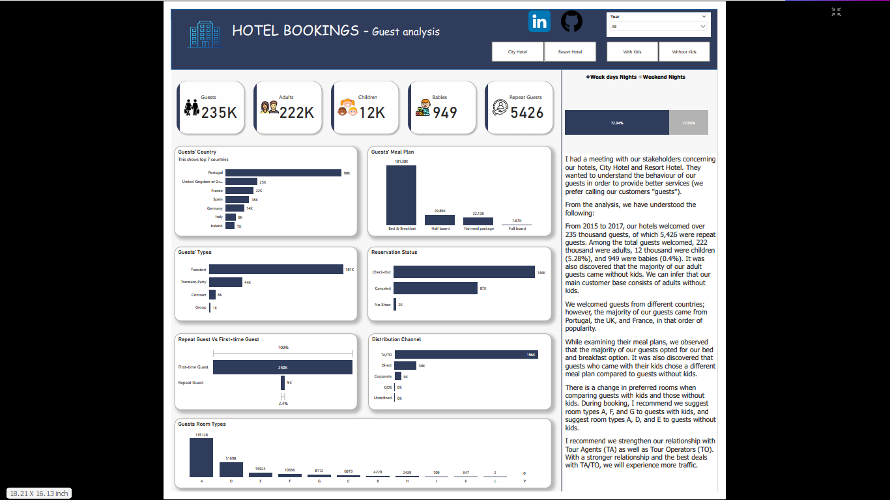

# Hotel Guest Analysis
This project is about hotel bookings, focusing on guest (customer) profiling and segmentation to provide better service to our guests.

.png)

# Introduction

Running a hotel is no easy task. In order to effectively operate a satisfactory hotel, you need to understand your guests' preferences, predict their needs, and make arrangements to meet those needs. This will undoubtedly address the business questions at hand.

# Business Questions

1. What is our guest demography?
2. What are our guests' preferences?
3. How many loyal guests do we have?
4. What can we do to increase hotel traffic?

# Data Source

The CSV dataset was provided by Onyx Data during their July 2023 challenge. You can download the dataset from their [website](https://onyxdata.ck.page/1e8beb9b02).

In addition, I obtained a list of countries and their ISO codes from Wikipedia using Power BI's web connector. I also created a custom table for the hotel's meal plan.

## Tools Used/Concepts Applied

For this project, I utilized Power BI and Power Query Editor. Additionally, I applied the following concepts:

- DAX Measure
- Data Modelling
- DAX Calendar Table

## Data Cleaning

The data was relatively clean, and only minor adjustments were required.

There was a column named "Children" with some N/A values that caused errors. I used the replace error function in Power Query Editor to handle these errors.

| Step 1 | Step 2 |
| ---| --- |
|  |  |

In Data View, I implemented the following DAX measures:

1. To create a date column by concatenating the year, month, and day of arrival:
   ```
   Arrival Date = DATE(hotel_bookings[year], hotel_bookings[month], hotel_bookings[day])
   ```

2. To segregate adult guests into two categories, those with kids and those without kids:
   ```
   With kids = IF(
                   OR(hotel_bookings[children] > 0, hotel_bookings[babies] > 0),
               "With Kids", "Without Kids")
   ```

# Data Modelling

Power BI automatically generated a star schema model. I cross-checked and corrected the relationships where necessary. The relationship is shown below:


# Report View

This project includes one dashboard titled "HOTEL BOOKINGS - Guest analysis." The dashboard contains three slicers that filter the year, with kids/without kids, and hotels. Additionally, there are LinkedIn and GitHub buttons that direct you to my respective pages.

To interact with the dashboard, click [here](https://app.powerbi.com/view?r=eyJrIjoiNjhmMTI3M2MtNWZmZS00YWQ0LThmMTgtOTdmZTg0M2NlOTEyIiwidCI6Ijc0N2YyYzZhLWY5NjMtNDgxNC04NGZkLTZlZjFlZTllODdiZiJ9&pageName=ReportSection).



# Insights Uncovered

From 2015 to 2017, our hotels welcomed over 235 thousand guests, of which 5,426 were repeat guests. Among the total guests welcomed, 222 thousand were adults, 12 thousand were children (5.28%), and 949 were babies (0.4%). It was also discovered that the majority of our adult guests came without kids, suggesting that our main customer base consists of adults without kids.

We welcomed guests from different countries; however, the majority of our guests came from Portugal, the UK, and France, in that order of popularity.

While examining their meal plans, we observed that the majority of our guests opted for our bed and breakfast option. It was also discovered that guests who came with their kids chose a different meal plan compared to guests without kids.

There is a change in preferred room types when comparing guests with kids and those without kids. During booking, I recommend suggesting room types A, F, and G to guests with kids and room types A, D, and E to guests without kids.

I recommend strengthening our relationship with Tour Agents (TA) as well as Tour Operators (TO). By establishing a stronger relationship and offering the best deals with TA/TO, we can expect an increase in traffic.

Additionally, I recommend improving our online presence to boost our direct bookings. This will reduce TA/TO incentives and costs.


